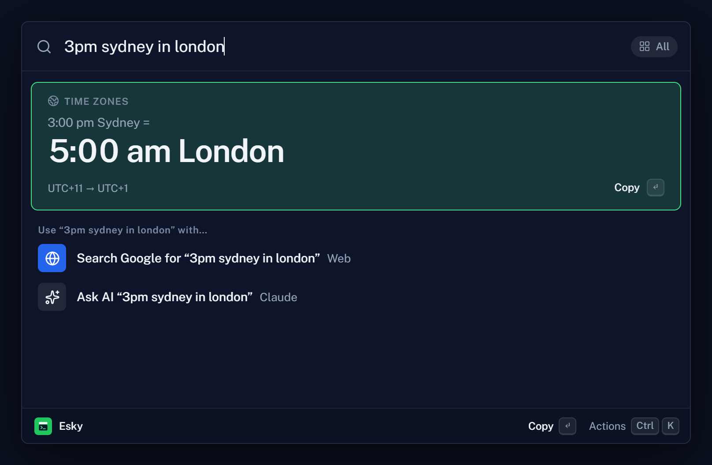
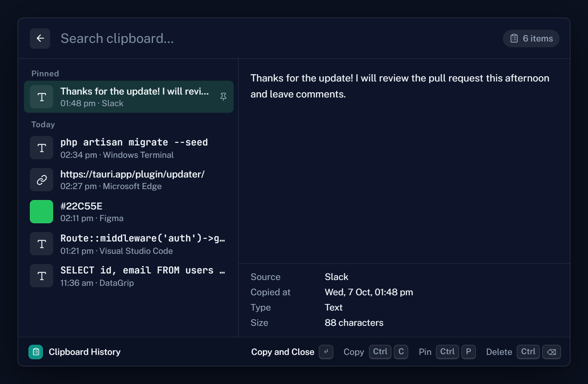
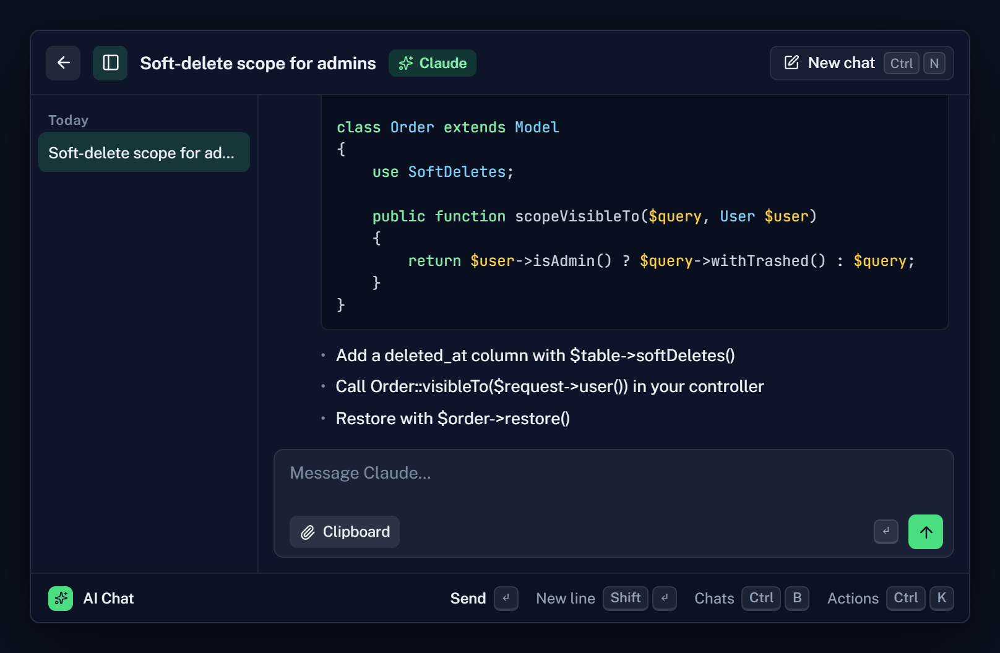
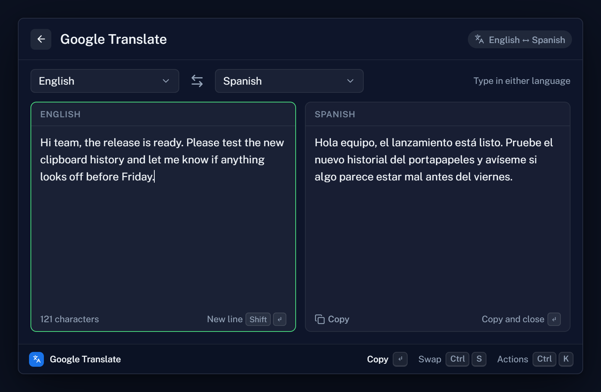
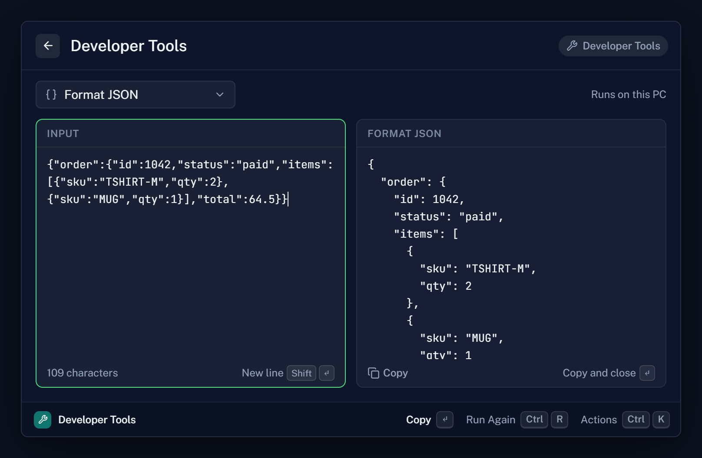
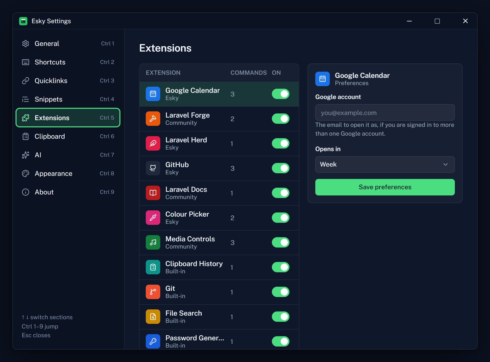

# Esky

Keyboard launcher for Windows. Nuxt 4 + Nuxt UI v4 + Tailwind v4, packaged with Tauri 2.

Press Alt Space anywhere to search apps, files, commands and open windows, and to calculate, convert currencies and units, and work out times across time zones.



| | |
|---|---|
|  |  |
| **Clipboard History.** Text, links, colours, images and files, pinned or pasted back into the app you came from. | **AI Chat and Quick AI.** Through your Claude Code login or an Anthropic API key, plus your own AI commands for selected text. |
|  |  |
| **Google Translate.** Between two languages you pick, in either direction. | **Developer Tools.** JSON, Base64, URL encoding, hashes, timestamps, JWTs and UUIDs. |

Also: snippets with typed-keyword expansion, quicklinks, window layouts and switching, file search, colour picker, media controls, password generator, dictionary, and extensions for Laravel Forge, Herd, GitHub, Jira, Sentry, Docker and Google Calendar.



## Requirements

- Node 22+
- For the desktop app: Rust (stable, MSVC toolchain), the Visual Studio 2022 Build Tools with the "Desktop development with C++" workload, and the WebView2 runtime. Install Rust from https://rustup.rs.

## Run

```bash
npm install
npm run dev          # browser build at http://localhost:1420
npm run tauri:dev    # desktop app (needs Rust)
npm run tauri:build  # NSIS + MSI installers in src-tauri/target/release/bundle
```

In the browser build there is no tray: press Alt Space (or click the "Esky is hidden" button) to reopen the launcher.

## Release

1. Bump `version` in `package.json` (Tauri reads it from there) and in `src-tauri/Cargo.toml`.
2. Move the notes under **Unreleased** in `CHANGELOG.md` to a new `## <version> - <date>` section.
3. Commit, then tag and push: `git tag v<version> && git push origin v<version>`.

`.github/workflows/release.yml` builds the NSIS and MSI installers on Windows and opens a draft GitHub release with that version's changelog notes. Publish the draft when it looks right.

### Jump to a state (dev only)

`http://localhost:1420/?scene=<key>` opens the launcher in a given state, e.g. `?scene=clip`, `?scene=hkConflict`, `?scene=onboard`. Keys are listed in `app/composables/useScene.ts`.

## Layout

| Path | What |
|---|---|
| `app/pages/index.vue` | Launcher window: global key map, blur-to-hide, global shortcuts |
| `app/pages/settings.vue` | Settings window (900 × 620) |
| `app/pages/float.vue` | Always-on-top floating note window |
| `app/composables/useLauncher.ts` | Launcher state, models, actions and the full key map |
| `app/composables/usePlatform.ts` | Tauri bridge (windows, shortcuts, clipboard, opener, autostart); no-ops in the browser |
| `app/composables/usePersist.ts` | Persistence: Tauri store (`esky.json`) or localStorage |
| `app/data/fixtures.ts` | Sample data. Replace with real providers |
| `app/utils/herd.ts`, `app/composables/useHerd.ts` | Laravel Herd sites from `~\.config\herd` (Tauri fs in the app, `server/api/herd/sites.get.ts` in the browser dev build) |
| `app/extensions/registry.ts` | Every extension: commands, preference fields, defaults. Settings and the Store read from here |
| `app/composables/useExtensions.ts`, `useSecrets.ts` | Installed / turned-on extensions, saved preferences, tokens (Windows Credential Manager in the app) |
| `app/utils/claude.ts`, `app/composables/useClaude.ts` | AI Chat and Quick AI through your Claude Code CLI (lean flags, stream parsing, plan usage). Desktop: Rust `claude_run`; browser preview: `server/api/claude/*` |
| `app/utils/dictionary.ts` | English dictionary via Wiktionary: senses, examples, pronunciation and word forms |
| `app/utils/git.ts`, `app/composables/useGitRepos.ts` | Git → Uncommitted Changes: parses `git status` for repos in the configured folders. Desktop: Rust `git_status`; browser preview: `server/api/git/status.get.ts` |
| `app/utils/password.ts`, `app/composables/usePassword.ts` | Password Generator (Bitwarden's options and rules); passphrases use `app/data/eff-wordlist.ts` |
| `app/components/launcher/` | Views, rows, dialogs, footer, onboarding |
| `src-tauri/` | Tauri shell: tray, Mica/Acrylic, single instance, plugins, capabilities |

Design tokens live in `app/assets/css/main.css` (both themes). Nuxt UI is themed in `app/app.config.ts`.

## License

MIT. See [LICENSE](LICENSE).
